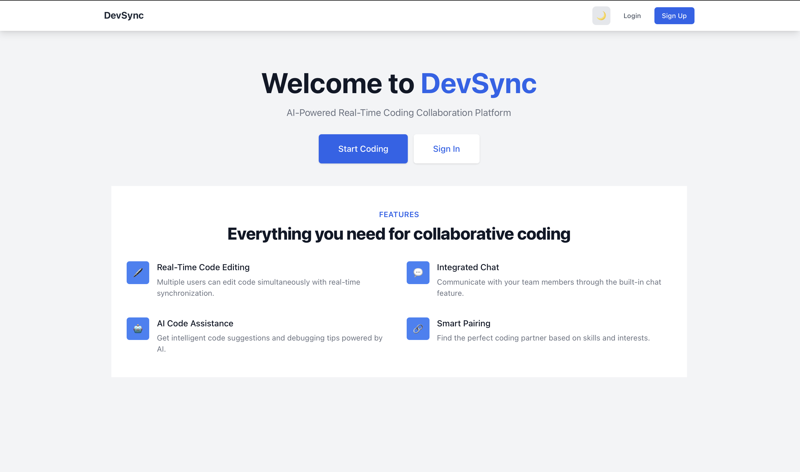
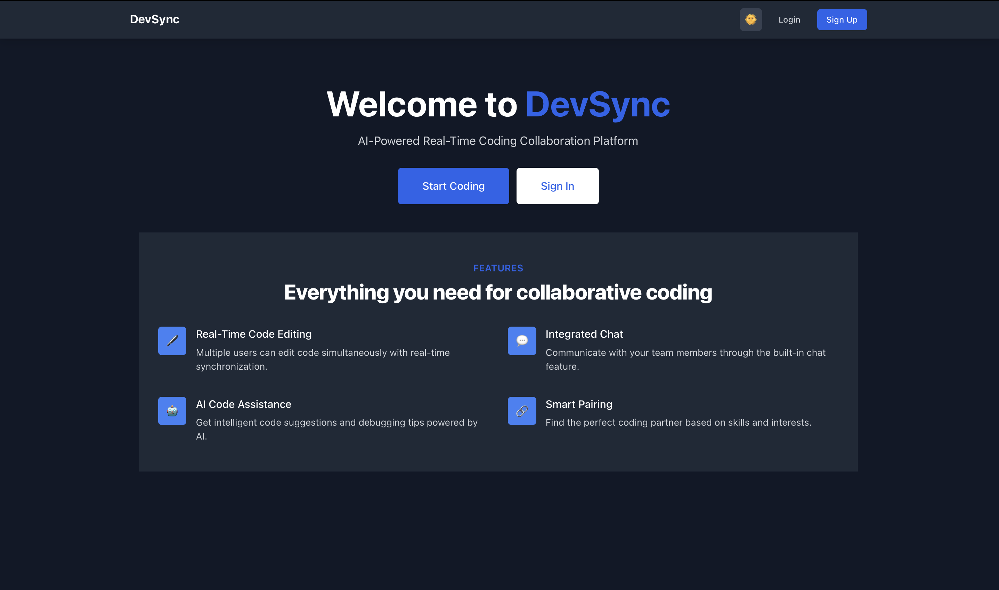
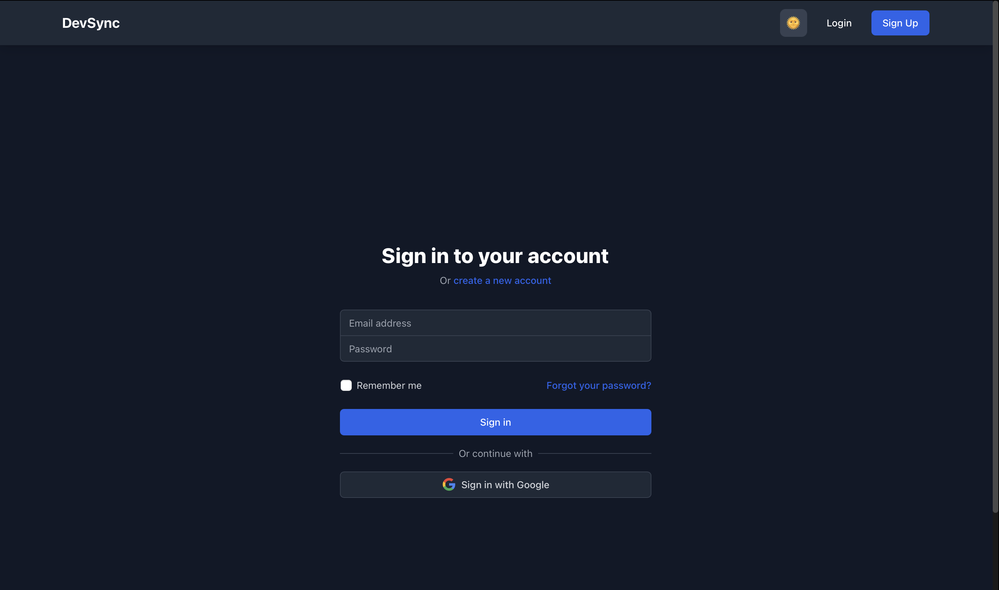
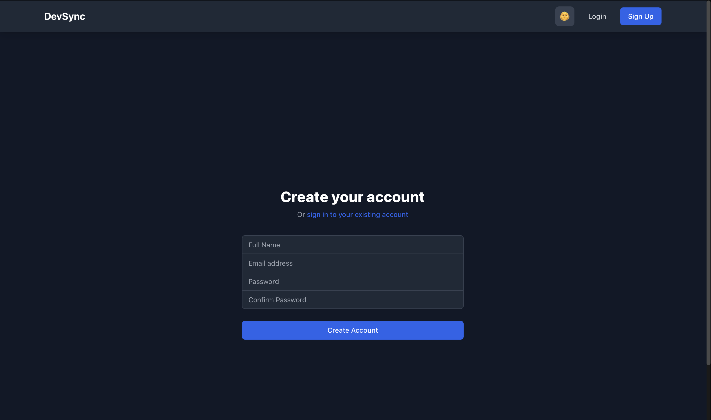
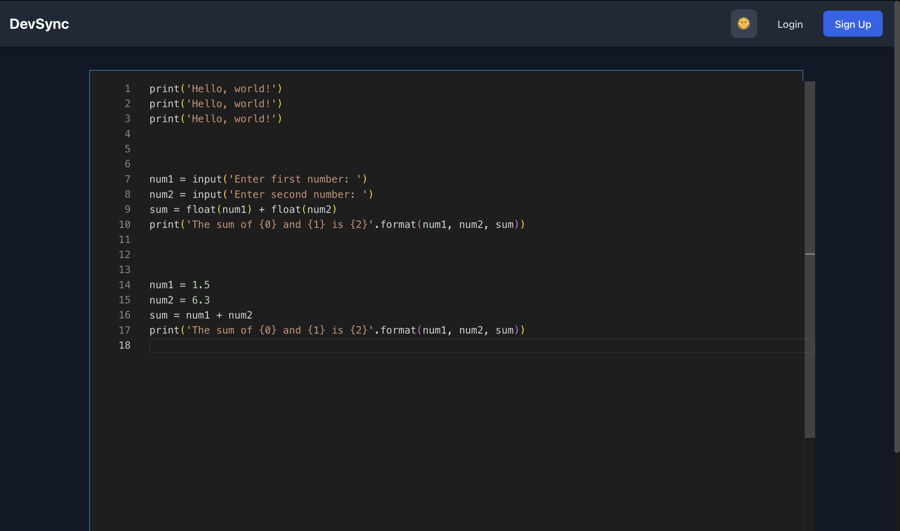

# DevSync

A real-time collaborative code editor with authentication and AI-powered code assistance.




## Features

- Real-time collaborative code editing
- User authentication (Email/Password & Google OAuth)
- AI-powered code suggestions and completions
- Syntax highlighting
- Multiple language support
- Dark/Light theme support

### Authentication



### Code Editor


## Tech Stack

### Frontend
- React.js
- Tailwind CSS
- Socket.io-client
- Axios
- React Router
- Context API for state management

### Backend
- Node.js
- Express.js
- MongoDB
- Socket.io
- Passport.js (Authentication)
- JWT (JSON Web Tokens)

## Prerequisites

- Node.js (v14 or higher)
- MongoDB
- Google OAuth credentials (for Google Sign-In)
- OpenAI API key (for AI code assistance)

## Installation

1. Clone the repository:
```bash
git clone https://github.com/yourusername/devsync.git
cd devsync
```

2. Install backend dependencies:
```bash
cd backend
npm install
```

3. Install frontend dependencies:
```bash
cd ../frontend
npm install
```

4. Set up environment variables:

Backend (.env):
```env
PORT=5001
MONGODB_URI=mongodb://localhost:27017/devsync
JWT_SECRET=your_jwt_secret_key
GOOGLE_CLIENT_ID=your_google_client_id
GOOGLE_CLIENT_SECRET=your_google_client_secret
FRONTEND_URL=http://localhost:3000
SERVER_URL=http://localhost:5001
```

Frontend (.env):
```env
REACT_APP_SERVER_URL=http://localhost:5001
REACT_APP_OPENAI_API_KEY=your_openai_api_key_here
```

## Running the Application

1. Start the backend server:
```bash
cd backend
npm start
```

2. Start the frontend development server:
```bash
cd frontend
npm start
```

3. Open your browser and navigate to `http://localhost:3000`

## Project Structure

```
devsync/
├── backend/
│   ├── src/
│   │   ├── config/
│   │   ├── models/
│   │   ├── routes/
│   │   └── server.js
│   ├── package.json
│   └── .env
├── frontend/
│   ├── src/
│   │   ├── components/
│   │   ├── context/
│   │   ├── pages/
│   │   └── App.js
│   ├── package.json
│   └── .env
├── images/
│   ├── LandingPage_LightTheme.png
│   ├── LandingPage_DarkTheme.png
│   ├── SignInPage.png
│   ├── SignUpPage.png
│   └── CodingNotepad.png
├── .gitignore
└── README.md
```

## Contributing

1. Fork the repository
2. Create your feature branch (`git checkout -b feature/amazing-feature`)
3. Commit your changes (`git commit -m 'Add some amazing feature'`)
4. Push to the branch (`git push origin feature/amazing-feature`)
5. Open a Pull Request

## License

This project is licensed under the MIT License - see the [LICENSE](LICENSE) file for details.

## Acknowledgments

- OpenAI for providing the API for code suggestions
- Socket.io for real-time collaboration
- MongoDB for database support
- All contributors and users of the project 